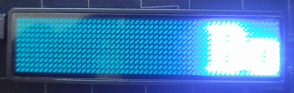
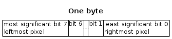
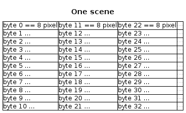
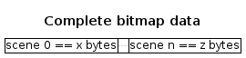

# Led-Badge-44x11

Upload tool for a LED name tag with USB-HID interface


Added Accentuated french Characters


## Hardware

The types supported by this project have an array of

- 44 x 11 LEDs or
- 48 x 12 LEDs.

The manufacturer is probably https://lesun-led.en.alibaba.com/

In both configurations, the badge identifies itself on the USB as

    idVendor=0416, idProduct=5020
    Mfr=1, Product=2, SerialNumber=0
    LSicroelectronics LS32 Custm HID

## Warning

There are many different versions of LED Badges on the market.
This one uses a USB-HID interface, while others use USB-Serial (see references below).

## Command Line Installation and Usage

### User access to badge on all Linuxes

The following will install a udev rule allowing anybody read/write
access to the badge via USB.

    sudo cp 99-led-badge-44x11.rules /etc/udev/rules.d/
    sudo udevadm control --reload-rules && sudo udevadm trigger

### Required dependencies on Debian/Ubuntu Systems

#### Using Debian/Ubuntu packages (recommended):

    sudo apt install python3-usb python3-pil

#### manually using a python virtual environment

Using a venv will allow to use pip to install dependencies without the danger
that the installed modules will interfere with the system installed ones.
On some systems (esp. those with Python 2 *and* 3 installed), you have to
address Python 3 explicitly by using the commands `python3` / `pip3` instead
of `python` / `pip`.

    sudo apt install python3-venv
    python -m venv ledtag
    source ledtag/bin/activate
    pip install pyhidapi pyusb pillow
    # this should now work:
    # python led-badge-11x44.py -m 6 -s 8 "Hello" "World!"

if the udev rules are installed, you should be able to access the badge without sudo / root privileges.

To reuse the venv again at a later point:

    source ledtag/bin/activate
    python led-badge-11x44.py …

### Required dependencies on Fedora Systems

    sudo dnf install hidapi python3-hidapi python3-pillow python3-pyusb

### Manual link the HID API lib for some Linuxes

For some distributions there is a discrepancy in where pyhidapi searches for the
lib and where the package hidapi places it. A simple solution is to link the
library to the needed place, e.g.

    ln -s /usr/lib/libhidapi-hidraw.so.0 /usr/local/lib/

### Required dependencies on Mac Systems

On some systems (esp. those with Python 2 *and* 3 installed), you have to
address Python 3 explicitly by using the command `pip3` instead of `pip`.

    sudo easy_install pip
    pip install pyhidapi
    pip install pillow
    ruby -e "$(curl -fsSL https://raw.githubusercontent.com/Homebrew/install/master/install)" < /dev/null 2> /dev/null
    brew install hidapi

### Required dependencies on Windows 7/10

For Windows, we need to set up the libusb API for the LED badge device.
The way described here, uses [libusb-win32](https://github.com/mcuee/libusb-win32/wiki)
in a quite low level way and in a quite old version:

- Please use version 1.2.6.0 of 'usblib-win32`. It's still available on the
  [old project repo on SourceForge](https://sourceforge.net/projects/libusb-win32/files/libusb-win32-releases/1.2.6.0/)
- Then
    - Extract `bin/inf-wizard.exe` from the downloaded zip file. Right click and `Run as Administrator`
    - `Next` -> Select `0x0416 0x5020 LS32 Custm HID` (or similar with the same IDs)
    - `Next` -> `Next` -> Save as dialog `LS32_Sustm_HID.inf` -> `Save` (just to proceed, we don't need that file)
    - `Install Now...` -> Driver Install Complete -> `OK`

There are other - meanwhile recommended, but untested here - ways to install and setup
newer versions of `libus-win32`: use
[Zadig](https://zadig.akeo.ie/) (it is also available from the old libusb-win32 repo on
[GitHub repo](https://github.com/mcuee/libusb-win32/releases) of newer releases)
or [libusbK](https://libusbk.sourceforge.net/UsbK3/index.html)

Of course, Python is needed:

- Download latest python from [python.org](https://www.python.org/downloads/),
or specific versions from [here](https://www.python.org/downloads/windows/)
    - Checkmark the following options
        - `[x]` install Launcher for all Users
        - `[x]` Add Python X.Y to PATH
    - Click the `Install Now ...` text message.

Install needed the Python packages. On some systems (esp. those with Python 2
*and* 3 installed), you have to address Python 3 explicitly by using the
command `pip3` instead of `pip`.

- Run cmd.exe as Administrator, enter:

        pip install pyusb
        pip install pillow

#### Examples:

To run these examples on linux, you might have to prepend `sudo` for accessing
the USB device or install a udev rule as stated above. On Windows, maybe you
have to run the `cmd.exe`, where you enter the commands, with `Run as administrator`,
which is similar to the `sudo`on linux.

On some systems (esp. those with Python 2 *and* 3 installed), you have to
address Python 3 explicitly by using `python3` instead of `python`. Run
`python -V` to see which version of python is configured as default.

    python ./led-badge-11x44.py "Hello World!"

loads the text 'Hello World!' as the first message, and scrolls it from right to left (default scroll mode=0) and speed
4 (default). After an upload the device shows the first message once and returns to the charging screen if still
connected to USB. Either pull the plug or press the small button next to the USB connector.

    python ./led-badge-11x44.py -m 6 -s 8 "Hello" "World!"

loads the text 'Hello' as message one and 'World!' as message two. Compare the difference in quoting to the previous
example. Up to 8 messages can be uploaded. This example uses mode 6, which drops the words with a nice little animation
vertically into the display area. Speed is set to maximum here, for smoothness.

Per default, you will only see 'Hello'. To see all messages, press the small button next to the USB connector multiple
times, until you briefly see 'M1-8'. Now the display loops through all uploaded messages.

    python ./led-badge-11x44.py -m 5 :gfx/fablabnbg_logo_44x11.png:

loads a fullscreen still image. Avoid whitespace between colons and name. If you receive a
message `ImportError: cannot import name '_imaging'`, then try to update the corresponding
package: `sudo pip install -U pillow`

    python ./led-badge-11x44.py "I:HEART2:my:gfx/fablab_logo_16x11.png:fablab:1:"

uses one builtin and one loaded image. The heart is builtin, and the fablab-logo is loaded from file. The fablab logo is
used twice, once before the word 'fablab' and again behind through the reference ':1:' (which references the first
loaded image).


    python ./led-badge-11x44.py -s7 -m0,1 :bicycle: :bicycle_r:

shows a bicycle crossing the display in left-to-right and right-to-left (as a second message). If you select the 'M1-8'
mode, the bike permanently runs back and forth the display. You may add a short message to one or both, to make it
appear the bike is pulling the text around.


    python ./led-badge-11-x44.py -b0,1 -s1 -m5 "  :heart2:    :HEART2:" "  :HEART2:"

shows a simple animation of a slowly beating heart on the first message, and a blinking heart on the second message.

    ./led-badge-11x44.py -B 50 -m 0 -s 8 "Bonjour à toutes et à tous" "Bienvenu(e)s en Master 2 EEA ISHM" "Ingénierie des systèmes Humains Machines" "Bonne réussite à votre promotion 2023-2024"



    python ./led-badge-11x44.py --list-names

prints the list of builtin icon names, including :happy: :happy2: :heart: :HEART: :heart2: :HEART2: :fablab: :bicycle: :
bicycle_r: :owncloud: ::

    python ./led-badge-11x44.py --help

lists all write methods. Does not write anything to the device.

    python ./led-badge-11x44.py -M list "dummy message"

lists all devices available with write method 'hidapi'. Does not write anything to the device.

    python ./led-badge-11x44.py -M hidapi -D list "dummy message"

programs a specific device with a specific write method.

    python ./led-badge-11x44.py -M hidapi -D "3-1:1.0" "Hello World!"

prints some condensed help:

    python ./led-badge-11x44.py -h

<pre>
usage: lednamebadge.py [-h] [-t TYPE] [-H HID] [-M METHOD] [-D DEVICE_ID]
                       [-s SPEED] [-B BRIGHTNESS] [-m MODE] [-b BLINK]
                       [-a ANTS] [-l]
                       MESSAGE [MESSAGE ...]

Upload messages or graphics to a 11x44 led badge via USB HID.
Version 0.14 from https://github.com/jnweiger/led-badge-ls32
 -- see there for more examples and for updates.

positional arguments:
  MESSAGE               Up to 8 message texts with embedded builtin icons or
                        loaded images within colons(:) -- See -l for a list of
                        builtins.

options:
  -h, --help            show this help message and exit
  -t TYPE, --type TYPE  Type of display: supported values are 12x48 or
                        (default) 11x44. Rename the program to led-
                        badge-12x48, to switch the default.
  -H HID, --hid HID     Deprecated, only for backwards compatibility, please
                        use -M! Set to 1 to ensure connect via HID API,
                        program will then not fallback to usb.core library.
  -M METHOD, --method METHOD
                        Force using the given write method. Use one of 'auto',
                        'list' or whatever list is printing.
  -D DEVICE_ID, --device-id DEVICE_ID
                        Force using the given device id, if ambiguous. Usue
                        one of 'auto', 'list' or whatever list is printing.
  -s SPEED, --speed SPEED
                        Scroll speed (Range 1..8). Up to 8 comma-separated
                        values.
  -B BRIGHTNESS, --brightness BRIGHTNESS
                        Brightness for the display in percent: 25, 50, 75, or
                        100.
  -m MODE, --mode MODE  Up to 8 mode values: Scroll-left(0) -right(1) -up(2)
                        -down(3); still-centered(4); animation(5); drop-
                        down(6); curtain(7); laser(8); See '--mode-help' for
                        more details.
  -b BLINK, --blink BLINK
                        1: blinking, 0: normal. Up to 8 comma-separated
                        values.
  -a ANTS, --ants ANTS  1: animated border, 0: normal. Up to 8 comma-separated
                        values.
  -l, --list-names      list named icons to be embedded in messages and exit.

Example combining image and text:
 sudo lednamebadge.py "I:HEART2:you"
</pre>

There are some options defining the default type:

- use `lednamebadge.py` directly: default type is 11x44
- rename `lednamebadge.py` to something with `12` (e.g. `badge12.py`) and use that: default type is 12x48
- use `led-badge-11x44.py`: default type is 11x44
- use `led-badge-12x48.py`: default type is 12x48

For all these options you can override the default type with command line option `-t`

There are two options to control which device is programmed with which method. At this time there are two write
methods:
one is using the python package pyusb (`libusb`), the other one is using pyhidapi (`hidapi`).

Depending on your execution environment both methods can be used, but sometime one does not work as expected. Then
you can choose the method to be used explicitly with option `-M`. With `-M list` you can print a list of available write
methods. If you have connected multiple devices, you can list up the ids with option `-D list` or give one of the
listed device ids to program that specific device. The default for both options is `auto`, which programs just the first
device found with preferably the write method `hidapi`. The IDs for the same device are different depending on the
write method. Also, they can change between computer startups or reconnects.

### Animations

See the gfx/starfield folder for examples. An animation of N frames is provided as an image N*48 pixels wide,
for both 48 and 44 pixel wide devices.

## Usage as module

### Writing to the device

You can use lednamebadge.py as a module in your own content creation code for writing your generated scenes to
the device.

- create the header
- append your own content
- write to device

The method `header()` takes a number of parameters:

- up to 8 lengths as a tuple of numbers
    - each length is the number of byte-columns for the corresponding bitmap data, that is the number of bytes of the
      corresponding bitmap data divided by 11 (for the 11x44 devices) respective 12 (for the 12x48-devices), where one
      byte is 8 pixels wide.
- arguments comparable to the command line arguments: up to 8 speeds, modes, blink-flags, ants-flags each as tuple of
  numbers, and an (optional) brightness as number.
- Optionally, you can give a timestamp as datetime. It is written to the device as part of the header, but not visible
  at the devices display.

Your own content has to be a byte array with the bitmap data for all scenes. Of course, it has to fit the given lengths.

See the following graphic for better understanding:





For a 12x48 device there have to be 12 bytes for each byte-column instead of 11, of course.



Example:

Let's say, you have 2 scenes, one is 11x32 pixels, one is 11x60 pixels. So, the first have 4 byte-columns and 44 bytes,
the second has to be padded with 4 empty bit-columns in the last byte-column to 11x64 pixels and has therefore
8 byte-columns and 88 bytes.

We like to display both in mode 4, the first one with speed 3 and the second one with speed 2 and the second one shall
be displayed with ants. And we like to set the initial brightness to 50%.

This would be achieved by these calls:

```python
from lednamebadge import LedNameBadge

buf = array('B')
buf.extend(LedNameBadge.header((4, 8), (3, 2), (4,), (0,), (0, 1), 50))
buf.extend(scene_one_bytes)
buf.extend(scene_two_bytes)
LedNameBadge.write(buf)
```

#### Specifying a write method or device id

There are two more parameters on the method `write`: the write method and the device id. They work exactly like the
command line option '-M' and '-D'. Both default to `auto`.

```
LedNameBadge.write(buf, 'libusb', '3:10:2')
```

Even with `list` you get the respective list of the available choices printed to stdout, which is less handy,
if used as a module. Therefore, there are 2 methods for retrieving this information as normal data objects:

1. `get_available_methods()` which returns all implemented write methods as a dict with the method names as
   the keys and a boolean each as the values. The boolean indicates if the method is basically usable (means the
   corresponding import succeeded)
2. `get_available_device_ids(method)` which returns information about all connected / available devices, also as
   a dict with the device ids as the keys and a descriptive string each as the values.

```
>>> import lednamebadge
>>> lednamebadge.LedNameBadge.get_available_methods()
{'hidapi': True, 'libusb': True}

>>> lednamebadge.LedNameBadge.get_available_methods('hidapi')
{'3-6:1.0': 'LSicroelectronics - LS32 Custm HID (if=0)', '3-7.3:1.0': 'LSicroelectronics - LS32 Custm HID (if=0)', '3-1:1.0': 'wch.cn - CH583 (if=0)'}

>>> lednamebadge.LedNameBadge.get_available_methods('libusb')
{'3:20:1': 'LSicroelectronics - LS32 Custm HID (bus=3 dev=20 endpoint=1)', '3:21:1': 'LSicroelectronics - LS32 Custm HID (bus=3 dev=21 endpoint=1)', '3:18:2': 'wch.cn - CH583 (bus=3 dev=18 endpoint=2)'}
```

This way you can connect multiple devices to one computer and program them one by another with different calls
to `write`.

If you have mor than one with the same description string, it is difficult distinguish which real device belongs to
which id. Esp. after a reconnect or restart, the ids may change or exchange. If you have different USB buses, connect
only one device to a bus. So you can decide by bus number. Or keep a specific connect order (while the computer is
already running), then you can decide by device number. Maybe the hidapi method is a bit more reliable. You have
to experiment a bit.
 

### Using the text generation

You can also use the text/icon/graphic generation of this module to get the corresponding byte buffers.

This is quite simple and just like with the command line usage. There is the additional option to create a bitmap just
and only from an image file by giving the filename instead of a message.

```python
from lednamebadge import SimpleTextAndIcons

creator = SimpleTextAndIcons()
scene_a_bitmap = creator.bitmap("Hello :HEART2: World!")
scene_b_bitmap = creator.bitmap("As you :gfx/bicycle3.png: like...")
scene_c_bitmap = creator.bitmap("gfx/starfield/starfield_020.png")
```

The resulting bitmaps are tuples with the byte array and the length each. These lengths can be used in header() directly
and the byte arrays can be concatenated to the header. Example:

```python
from lednamebadge import *

creator = SimpleTextAndIcons()
scene_x_bitmap = creator.bitmap("Hello :HEART2: World!")
scene_y_bitmap = creator.bitmap("Complete example ahead.")
your_own_stuff = create_own_bitmap_data()

lengths = (scene_x_bitmap[1], scene_y_bitmap[1], your_own_stuff.len)
buf = array('B')
buf.extend(LedNameBadge.header(lengths, (3,), (0,), (0, 1, 0), (0, 0, 1), 100))
buf.extend(scene_x_bitmap[0])
buf.extend(scene_y_bitmap[0])
buf.extend(your_own_stuff.bytes)
LedNameBadge.write(buf)
```

## Development

### Generating Plantuml graphics

You will need PlantUML and potentially GraphViz dot to generate the diagrams from the *.puml files.

Just run `plantuml "*.puml"` from the `photos` directory to regenerate all diagrams.

### Running the unit tests

Run `python run_tests.py` from the `tests` directory.

## Related References (for USB-Serial devices)

* https://github.com/Caerbannog/led-mini-board
* http://zunkworks.com/projects/programmablelednamebadges/
* https://github.com/DirkReiners/LEDBadgeProgrammer
* https://bitbucket.org/bartj/led/src
* http://www.daveakerman.com/?p=1440
* https://github.com/stoggi/ledbadge
