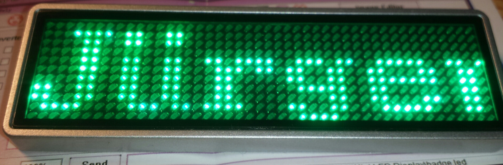
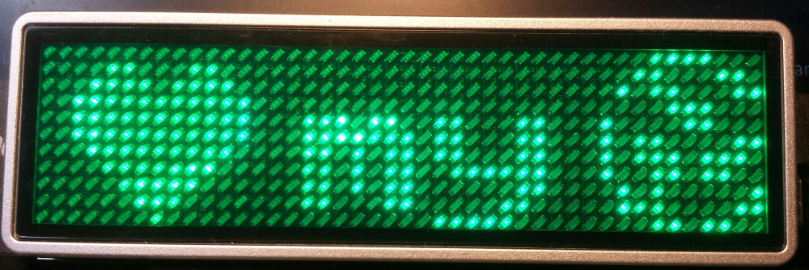
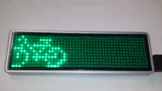

# Led-Badge-44x11
Upload tool for an led name tag with USB-HID interface

## Hardware

The types supported by this project have an array of

- 44 x 11 LEDs or
- 48 x 12 LEDs.

The manufacturer is probably https://lesun-led.en.alibaba.com/

In both configurations, the badge identifies itself on the USB as

    idVendor=0416, idProduct=5020
    Mfr=1, Product=2, SerialNumber=0
    LSicroelectronics LS32 Custm HID

## Warning

There are many different versions of LED Badges on the market.
This one uses an USB-HID interface, while others use USB-Serial (see references below).

## Command Line Installation and Usage

### User access to badge on all Linuxes

The following will install a udev rule allowing anybody read/write
access to the badge via USB.

    sudo cp 99-led-badge-44x11.rules /etc/udev/rules.d/
    sudo udevadm control --reload-rules && sudo udevadm trigger

### Required dependencies on Debian/Ubuntu Systems

    sudo pip install pyhidapi
    sudo pip install pillow
    sudo apt-get install libhidapi-hidraw0
    sudo ln -s /usr/lib/x86_64-linux-gnu/libhidapi-hidraw.so.0  /usr/local/lib/
  or
    sudo apt install python3-usb python3-pil

### Required dependencies on Fedora Systems

    sudo dnf install hidapi python3-hidapi python3-pillow python3-pyusb

### Required dependencies on Mac Systems

    sudo easy_install pip
    pip install pyhidapi
    pip install pillow
    ruby -e "$(curl -fsSL https://raw.githubusercontent.com/Homebrew/install/master/install)" < /dev/null 2> /dev/null
    brew install hidapi
  or
    Try with `pip3 install pyhidapi`

### Required dependencies on Windows 10

    Download win/inf-wizard.exe to your desktop. Right click 'Run as Administrator'
       -> Click 0x0416 0x5020 LS32 Custm HID
       -> Next -> Next -> Documents LS32_Sustm_HID.inf -> Save (we don't need that file)
       -> Install Now... -> Driver Install Complete -> OK

    Download python from python.org
      [x] install Launcher for all Users
      [x] Add Python 3.7 to PATH
       -> Click the 'Install Now ...' text message.

    Run cmd.exe as Administrator, enter:
      pip install pyusb
      pip install pillow

### Required dependencies on Windows 7

    Download win/win32-bin-1.2.6.0.zip to your desktop. Extract.
    Find the inf-wizard.exe in the bin folder. Right click 'Run as Administrator'
    Then continue as with windows 10 above.

#### Examples:

Sudo may or may not be needed for accessing the USB device, depending on your system.

    sudo python3 ./led-badge-11x44.py "Hello World!"

loads the text 'Hello World!' as the first message, and scrolls it from right to left (default scroll mode=0) and speed 4 (default). After an upload the device shows the first message once and returns to the charging screen if still connected to USB. Either pull the plug or press the small button next to the USB connector.

    sudo python3 ./led-badge-11x44.py -m 6 -s 8 "Hello" "World!"

loads the text 'Hello' as message one and 'World!' as message two. Compare the difference in quoting to the previous example. Up to 8 messages can be uploaded. This example uses mode 6, which drops the words with a nice little animation vertically into the display area. Speed is set to maximum here, for smoothness.

Per default you will only see 'Hello'.  To see all messages, press the small button next to the USB connector multiple times, until you briefly see 'M1-8'. Now the display loops through all uploaded messages.

    sudo python3 ./led-badge-11x44.py -m 5 :gfx/fablabnbg_logo_44x11.png:

loads a fullscreen still image. Avoid whitespace between colons and name. If you receive a message `ImportError: cannot import name '_imaging'`, then try to update the corresponding package: `sudo pip install -U Pillow`

    sudo python3 ./led-badge-11x44.py "I:HEART2:my:gfx/fablab_logo_16x11.png:fablab:1:"

uses one builtin and one loaded image. The heart is builtin, and the fablab-logo is loaded from file. The fablab logo is used twice, once before the word 'fablab' and again behind through the reference ':1:' (which references the first loaded image).

    sudo python3 ./led-badge-11x44.py -s7 -m0,1 :bicycle: :bicycle_r:

shows a bicycle crossing the display in left-to-right and right-to-left (as a second message). If you select the 'M1-8' mode, the bike permanently runs back and forth the display. You may add a short message to one or both, to make it appear the bike is pulling the text around.

    sudo python3 ./led-badge-11x44.py -b0,1 -s1 -m5 "  :heart2:    :HEART2:" "  :HEART2:"

shows a simple animation of a slowly beating heart on the first message, and a blinking heart on the second message.

    python3 ./led-badge-11x44.py --list-names

prints the list of builtin icon names, including :happy: :happy2: :heart: :HEART: :heart2: :HEART2: :fablab: :bicycle: :bicycle_r: :owncloud: ::

    python3 ./led-badge-11x44.py --help

prints some condensed help:

<pre>
usage: led-badge-11x44.py [-h] [-t TYPE] [-s SPEED] [-m MODE] [-b BLINK]
			  [-a ANTS] [-p FILE] [-l]
                          MESSAGE [MESSAGE ...]

Upload messages or graphics to a 44x11 led badge via USB HID.
Version 0.6 from https://github.com/jnweiger/led-badge-44x11
 -- see there for more examples and for updates.

positional arguments:
  MESSAGE               Up to 8 message texts with embedded builtin icons or
                        loaded images within colons(:) -- See -l for a list of
                        builtins

optional arguments:
  -h, --help            show this help message and exit
  -t TYPE, --type TYPE
			Type of display: supported values are 12x48 or
			(default) 11x44. Rename the program to led-badge-12x48,
			to switch the default.
  -s SPEED, --speed SPEED
                        Scroll speed (Range 1..8). Up to 8 comma-seperated
                        values
  -m MODE, --mode MODE  Up to 8 mode values: Scroll-left(0) -right(1) -up(2)
                        -down(3); still-centered(4); animation(5); drop-
                        down(6); curtain(7); laser(8); See '--mode-help' for
                        more details.
  -b BLINK, --blink BLINK
                        1: blinking, 0: normal. Up to 8 comma-seperated values
  -a ANTS, --ants ANTS  1: animated border, 0: normal. Up to 8 comma-seperated
                        values
  -l, --list-names      list named icons to be embedded in messages and exit

Example combining image and text:
 sudo ./led-badge-11x44.py "I:HEART2:you"
</pre>

## Related References (for USB-Serial devices)
 * https://github.com/Caerbannog/led-mini-board
 * http://zunkworks.com/projects/programmablelednamebadges/
 * https://github.com/DirkReiners/LEDBadgeProgrammer
 * https://bitbucket.org/bartj/led/src
 * http://www.daveakerman.com/?p=1440
 * https://github.com/stoggi/ledbadge
